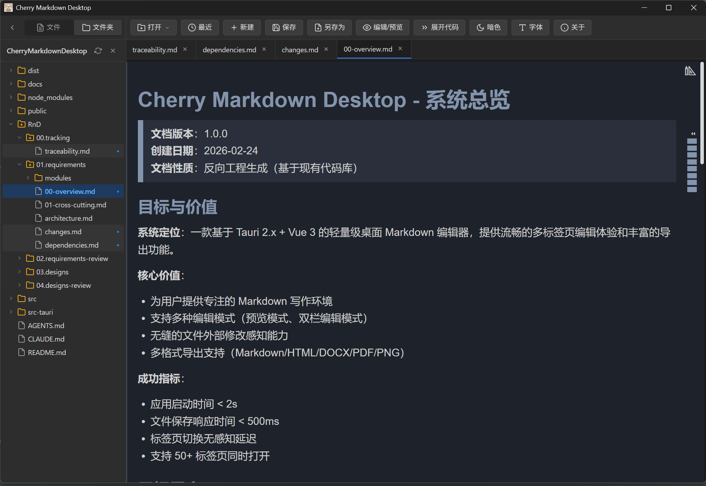
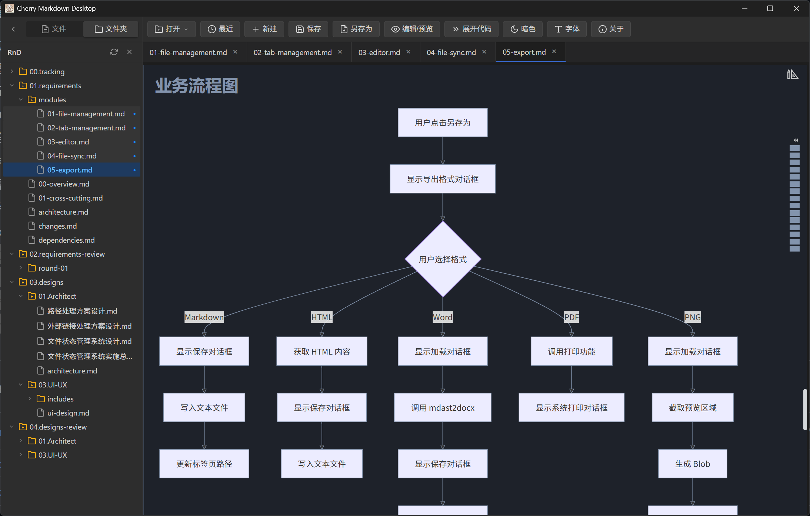

# Cherry Markdown Desktop

基于 Cherry Markdown 和 Tauri 的桌面版 Markdown 编辑器。
因开发环境限制，目前只支持 Windows 10 / 11。如果需要 Linux 或者 MacOS 版本，请自行编译。

最初我使用广为人知的Typora，它很强大易用，后来换成了MarkText，也是一个很优秀的Markdown编辑器。
只是MarkText已经多年未更新，在打开较大文档时，性能较弱，阅读体验不够顺畅，对mermaid语法的支持也跟不上时代，所以打算再找一个开源的平替。
现在 SDD 时代，作为一个码农天天都在审markdown文档，工具不给力是真的很难受了，我在vs code扩展库里找到一个 Markdown Preview Enhanced ，颇为惊艳，适合在vs code里阅读和编辑markdown文档。
但我还是希望有一个独立的markdown阅读器/编辑器，因为我并不总是想开着vs code，而且一旦开了vs code，笔记本嗖嗖掉电量，在频繁移动办公的场合会比较焦虑。
最近听说了腾讯开源的 Cherry Markdown 组件，足够强大足够美观易用，只是竟然没有找到一个合适的桌面版，所以决定还是自己Vibe一个吧。
搞了几天基本可用了，分享出来给需要的小伙伴们。

20260117 补充：
后来我才知道其实 Cherry Markdown 官方也提供了一个基于 Tauri 的客户端，它正在开发中，尚未正式发布。参考 [官方客户端](https://github.com/Tencent/cherry-markdown/tree/dev/packages/client) 。欢迎小伙伴们为官方客户端贡献力量。

## 更新日志

### v0.2.0

**新增功能**：
- 侧边栏：支持文件夹浏览器和已打开文件列表，可拖拽调整宽度
- 标签页右键菜单：复制文件名、复制文件路径
- 代码块折叠/展开功能
- TOC 目录锚点链接跳转
- 外部链接在默认浏览器中打开
- 本地资源链接支持（asset.localhost 协议）
- 全局错误处理和对话框系统
- 文件同步状态管理（外部修改检测与重新加载）
- Word 导出增强：Mermaid 图表、图片、GFM 表格支持
- 增加对HTML文件的支持（只读显示）
- “最近”功能支持文件夹
- 文件树tooltip显示修改时间和文件大小
- 统一路径分隔符

**技术改进**：
- 从 @md2docx/md2docx 迁移到自维护的 mdast2docx 工具链
- 添加 vitest 单元测试框架

## 功能特点




### 核心编辑功能

- ✅ 完整的 Markdown 编辑支持（基于 Cherry Markdown）
- ✅ 多种编辑模式：纯预览、双栏编辑/预览
- ✅ 语法高亮、代码块、数学公式、Mermaid 图表支持
- ✅ 代码块折叠/展开功能
- ✅ TOC 目录锚点链接跳转

### 文件操作

- ✅ 新建 Markdown 文件
- ✅ 打开本地文件（支持 `Ctrl+O` 快捷键）
- ✅ 打开文件夹（侧边栏文件浏览器）
- ✅ 保存文件（支持 `Ctrl+S` 快捷键）
- ✅ 另存为功能
- ✅ 多标签页编辑，支持同时打开多个文件
- ✅ 自动记录最近打开的文件（最多 20 个）
- ✅ 标签页右键菜单：关闭左侧/右侧/全部、复制文件名/路径

### 导出功能

- ✅ Word 文档（.docx）导出（支持 Mermaid 图表、图片、GFM 表格）
- ✅ 多格式导出（HTML、PDF、Word）

### 用户体验

- ✅ 桌面原生应用体验（Tauri 2.x）
- ✅ 侧边栏（文件夹浏览器、已打开文件列表）
- ✅ 侧边栏宽度可拖拽调整
- ✅ 编辑器字号调节（中、大、特大三档）
- ✅ 亮色/暗色主题切换
- ✅ 编辑器模式自动保存与恢复
- ✅ 外部文件修改监控与重新加载确认
- ✅ 关闭标签页/窗口时未保存变更提示
- ✅ 单实例运行支持（双击文件自动在已打开实例中打开）
- ✅ 点击 Markdown 内部链接自动在新标签中打开
- ✅ 外部链接在默认浏览器中打开
- ✅ 关于对话框
- ✅ 等宽字体切换功能
- ✅ 前端日志系统
- ✅ Mermaid 图表动态加载与暗色主题支持
- ✅ 全局错误处理与对话框系统

### 技术特性

- ✅ 跨平台桌面框架（目前主要支持 Windows 10/11）
- ✅ 轻量级状态管理（Vue 3 Composition API）
- ✅ 响应式界面设计
- ✅ 单元测试覆盖（vitest）

## 环境要求

在运行此项目之前，需要安装以下工具：

### 1. Node.js

当前版本: v22.16.0

### 2. Rust 工具链

Tauri 需要 Rust 编译工具链。

### 3. WebView2 (Windows 10/11)

Windows 10/11 通常已预装，如需安装:
https://developer.microsoft.com/en-us/microsoft-edge/webview2/

## 使用方法

### 开发模式运行

安装完 Rust 后，执行:

```bash
pnpm tauri dev
```

这将启动开发服务器并打开应用窗口。

### 构建桌面应用

构建 Windows 可执行文件:

```bash
pnpm tauri build
```

构建完成后，可执行文件位于:
`src-tauri/target/release/CherryMarkdownDesktop.exe`

### 运行测试

```bash
pnpm test          # 运行所有测试
pnpm test:watch    # 监听模式运行测试
```

## 项目结构

```
src/
├── components/
│   ├── CherryEditor.vue      # Cherry Markdown 编辑器封装
│   ├── TabBar.vue            # 标签页栏
│   ├── TabContextMenu.vue    # 标签页右键菜单
│   ├── Toolbar.vue           # 工具栏
│   ├── Sidebar/              # 侧边栏组件
│   │   ├── Sidebar.vue
│   │   ├── SidebarTabs.vue
│   │   ├── FileExplorerPanel.vue
│   │   ├── OpenFilesPanel.vue
│   │   └── FileTreeNode.vue
│   └── *Dialog.vue           # 各种对话框组件
├── stores/
│   ├── tabStore.ts           # 标签页状态管理
│   ├── sidebarStore.ts       # 侧边栏状态管理
│   ├── fileSyncStatus.ts     # 文件同步状态
│   └── fileWatchManager.ts   # 文件监视管理
├── utils/
│   ├── logger.ts             # 日志工具
│   ├── pathUtils.ts          # 路径处理工具
│   └── mdast2docx/           # Markdown 转 Word 工具链
└── App.vue                   # 根组件
```

## 技术栈

- **前端框架**: Vue 3 (Composition API, TypeScript)
- **桌面框架**: Tauri 2.x (Rust 后端)
- **编辑器**: Cherry Markdown 0.10.3
- **构建工具**: Vite 7.x
- **包管理器**: pnpm
- **测试框架**: Vitest
- **Tauri 插件**: `@tauri-apps/plugin-dialog`, `@tauri-apps/plugin-fs`, `@tauri-apps/plugin-opener`

## 注意事项

- 首次运行开发模式时，Tauri 会编译 Rust 代码，可能需要几分钟
- 确保已安装 WebView2 (Windows)
- 开发模式下应用监听 http://127.0.0.1:3071

## 开源协议

Apache 2.0
