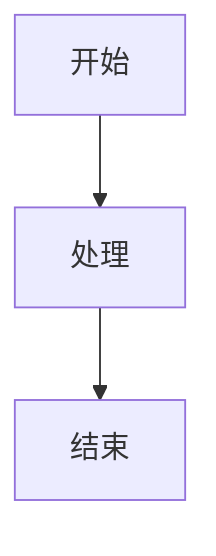
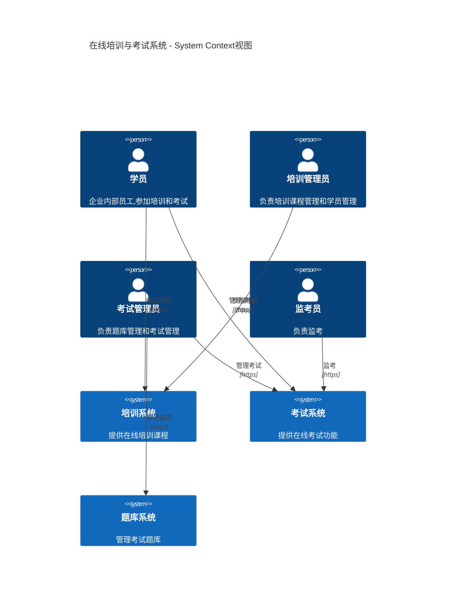

# Mermaid 图表导出到 Word 的研究与尝试

**日期**: 2025-01-27
**分支**: mdast2docx
**目标**: 解决大型复杂 Mermaid 图表（如 C4Context，45KB+ SVG）导出到 Word 失败的问题

## 问题描述

### 初始问题
使用第三方库 `mdast2docx` 替换自定义的 Word 导出实现时，遇到大型复杂 Mermaid 图表导出失败：

```
AggregateError: All promises were rejected
InvalidStateError: The object is in an invalid state
```

### 核心矛盾
- **Cherry Markdown 预览模式**：大型 Mermaid 图表（C4Context，45KB SVG）渲染正常
- **导出到 Word**：同样的图表导出时失败

## 技术背景

### mdast2docx 架构
```
Markdown → mdast AST → @m2d/plugins → DOCX
```

关键插件：
- `@m2d/mermaid`: 将 Mermaid 代码块转换为 SVG
- `@m2d/image`: 将 SVG 转换为图片（PNG/JPG）插入 Word
- `@svg-fns/svg2img`: 提供 SVG → Blob 转换功能

### 图表类型
支持的 Mermaid 图表类型（19种）：
- flowchart, sequence, gantt, journey, timeline
- class, state, er, pie, quadrantChart, xyChart
- requirement, architecture, mindmap, kanban
- gitGraph, c4, sankey, packet, block, radar

### 问题图表
主要问题出现在大型 C4 架构图：
- C4Context
- C4Component
- C4Deployment
- C4Dynamic
- C4Sequence

**特征**：
- SVG 大小：45KB+（46597 字符）
- 尺寸：1564x1232 像素
- PNG 转换后：255KB

---

## 尝试过的方案

### 方案 1: 直接使用 @m2d/mermaid（失败）

**做法**：
直接使用官方的 `@m2d/mermaid@1.2.2` 插件。

**问题**：
1. 包含不合理的自动 `trim` 逻辑，会破坏某些 Mermaid 图表的语法
2. Cherry Markdown 预览正常（无 trim），但导出失败（有 trim）

**代码问题**：
```typescript
// @m2d/mermaid 的原始代码
if (!/^mindmap|gantt|gitGraph|timeline|c4/i.test(value)) {
  value = value.split("\n").map(line => line.trim()).join("\n");
}
```

**结果**：❌ 失败

---

### 方案 2: 自定义 mermaid.ts 替换 @m2d/mermaid（部分成功）

**做法**：
1. 创建 `src/utils/md2docx/mermaid.ts`
2. 移除自动 trim 逻辑
3. 添加 SVG 后处理（参考 cherry-markdown）

**改进内容**：
```typescript
const fixSvgIssues = (svg: string): string => {
  return svg
    .replace(/<br>/g, '<br/>')           // 修复自闭合标签
    .replace(/\s*x="NaN"/g, '')           // 移除 NaN 坐标值
    .replace(/\s*markerUnits="0"/g, '');  // 移除无效的 markerUnits 属性
};
```

**结果**：
- ✅ 简单 Mermaid 图表导出成功
- ❌ 大型复杂图表（C4Context）仍然失败

---

### 方案 3: 修改 @m2d/image 源码，使用 Worker 版本的 svgToBlob（失败）

**问题分析**：
`@m2d/image` 的 `handleSvg` 函数调用主线程版本的 `svgToBlob`：

```typescript
// 主线程版本 - 失败
const img = new Image();
img.src = URL.createObjectURL(svgBlob);  // ❌ 大型 SVG Blob URL 无法加载
await new Promise<void>((res, rej) => {
  img.onload = () => res();
  img.onerror = rej;  // 在这里 rejected
});
```

**尝试方案**：
修改 `D:\Backup\thirdparty\md2docx\image-1.4.0\lib\src\svg-utils.ts`，使用 Worker 版本：

```typescript
import { svgToBlobWorkerLogic } from "@svg-fns/svg2img";

// Worker 版本 - 使用 createImageBitmap
const imgBitmap = await createImageBitmap(svgBlob);  // ✅ 可以处理大型 SVG
const canvas = new OffscreenCanvas(w, h);
ctx.drawImage(imgBitmap, 0, 0, w, h);
```

**遇到的问题**：
1. 修改的是 1.4.0 版本的源码，但项目使用的是 1.4.1 版本
2. 修改没有生效
3. `AggregateError` 依然出现

**结果**：❌ 失败（版本不匹配）

---

### 方案 4: 从 Cherry 预览捕获已渲染的 PNG（部分成功）

**思路**：
既然 Cherry Markdown 预览可以正常渲染，那么：
1. 从预览 DOM 中提取已渲染的 SVG
2. 使用 Canvas 转换为 PNG
3. 将 PNG 传递给 mermaid.ts，避免重新渲染

**实现**：

#### 4.1 CherryEditor.vue - 捕获 PNG

```typescript
const captureRenderedMermaidPngs = async (): Promise<Map<string, { buffer: ArrayBuffer; width: number; height: number }>> => {
  // 1. 自动切换到预览模式
  cherryEditor?.switchModel('previewOnly');
  await new Promise(resolve => setTimeout(resolve, 1000));

  // 2. 查找 Mermaid 元素
  const svgElements = previewerDom.querySelectorAll('svg');

  // 3. 逐个转换为 PNG
  for (const [index, svgElement] of Array.from(svgElements).entries()) {
    try {
      // 尝试方法1: 使用 Canvas + Image 对象
      const canvas = document.createElement('canvas');
      const ctx = canvas.getContext('2d');
      const img = new Image();

      // 问题：大型 SVG Blob URL 加载失败！
      img.src = URL.createObjectURL(new Blob([svgString], { type: 'image/svg+xml' }));
      await new Promise((res, rej) => {
        img.onload = res;
        img.onerror = rej;  // ❌ 大型 SVG 在这里失败
      });

      ctx.drawImage(img, 0, 0);
      const pngBlob = await canvas.toBlob('image/png');
      const buffer = await pngBlob.arrayBuffer();

      pngCache.set(String(index), { buffer, width, height });
    } catch (error) {
      // 回退方案：直接保存 SVG data URL
      const svgDataUrl = svgToDataUrl(svgString);
      pngCache.set(String(index), { buffer: svgDataUrl, ... });
    }
  }

  return pngCache;
};
```

**问题**：
- 大型 SVG 的 Blob URL 在 `Image` 对象加载时失败
- 回退到保存 SVG data URL

#### 4.2 mermaid.ts - 使用缓存的 PNG

```typescript
const cachedPng = options?.renderedPngCache?.get(String(mermaidIndex));

if (cachedPng) {
  // 方案 A: 如果是 PNG，嵌入到 SVG 中
  const base64Png = btoa(String.fromCharCode(...new Uint8Array(cachedPng.buffer)));
  const pngDataUrl = `data:image/png;base64,${base64Png}`;

  const svgWithPng = `<svg xmlns="http://www.w3.org/2000/svg" width="${width}" height="${height}">
    <image href="${pngDataUrl}" width="${width}" height="${height}"/>
  </svg>`;

  return {
    svg: svgWithPng,
    diagramType: 'gantt',  // 跳过 tightlyCropSvg
  };
}
```

**问题**：
1. SVG 中嵌入的 PNG（340KB）仍然要经过 @m2d/image 处理
2. @m2d/image 再次尝试调用 `svgToBlob`，仍然失败
3. `AggregateError: All promises were rejected`

**结果**：❌ 失败（PNG 嵌入 SVG 后仍需处理）

---

### 方案 5: 直接创建 Image 节点，绕过 @m2d/image（部分成功）

**关键突破**：
既然我们已经有 PNG 了，为什么不直接创建 Image 节点，完全绕过 SVG 处理？

**实现**：
```typescript
// preprocess 函数中
const cachedPng = options?.renderedPngCache?.get(String(mermaidIndex));

if (cachedPng) {
  // 将 PNG buffer 转换为 base64 data URL
  const uint8Array = new Uint8Array(cachedPng.buffer);
  const binaryString = Array.from(uint8Array, byte => String.fromCharCode(byte)).join('');
  const base64Png = btoa(binaryString);
  const pngDataUrl = `data:image/png;base64,${base64Png}`;

  // *** 关键：直接创建 Image 节点，而不是 SVG 节点 ***
  const imageNode = {
    type: 'image',
    url: pngDataUrl  // data:image/png;base64,...
  } as any;

  Object.assign(node, {
    type: "paragraph",
    children: [imageNode],
    data: { alignment: "center" },
  });

  return;  // 提前返回，不创建 SVG 节点
}
```

**优势**：
1. ✅ 完全绕过 @m2d/image 的 SVG 处理流程
2. ✅ @m2d/image 识别为普通图片 URL（data:image/png;base64,...）
3. ✅ 直接下载并插入到 Word 文档

**测试结果**：
- ✅ 有缓存的图表：成功导出
- ❌ 无缓存的图表：仍然尝试 SVG → @m2d/image → 失败

**限制**：
- 依赖 Cherry 预览已渲染
- 每次导出前都要切换到预览模式（延迟 1 秒）
- 如果 Cherry 预览未完成，捕获会失败

**结果**：⚠️ 部分成功（有缓存的图表可以，无缓存的失败）

---

## 核心问题分析

### 问题 1: Image 对象无法加载大型 SVG Blob URL

**原因**：
浏览器对 `Image` 对象加载的 Blob URL 有大小限制，特别是大型复杂 SVG。

**证据**：
```javascript
const svgBlob = new Blob([largeSvg], { type: 'image/svg+xml' });
const img = new Image();
img.src = URL.createObjectURL(svgBlob);  // 45KB+ SVG
await new Promise((res, rej) => {
  img.onload = res;
  img.onerror = (err) => {
    console.error('Failed to load SVG Blob URL');
    rej(err);  // ❌ 在这里 rejected
  };
});
```

**为什么 Cherry 预览可以**：
- Cherry 使用 `mermaid.render()` 直接操作 DOM
- 不经过 `Image` 对象
- SVG 直接插入页面作为 `<svg>` 元素

### 问题 2: mdast2docx 的设计限制

**当前流程**：
```
Markdown → Mermaid 代码 → @m2d/mermaid.render() → SVG 字符串
→ @m2d/image.handleSvg() → svgToBlob() → Image 对象 → 失败 ❌
```

**根本矛盾**：
- Cherry Markdown：直接使用 DOM（`<svg>` 元素）
- mdast2docx：需要将 SVG 字符串转换为图片（用于 Word）
- 转换过程依赖 `Image` 对象，但大型 SVG Blob URL 无法加载

### 问题 3: Worker 版本也无法解决

虽然 `svgToBlobWorkerLogic` 使用 `createImageBitmap` 理论上可以处理大型 SVG：

```typescript
const imgBitmap = await createImageBitmap(svgBlob);  // 理论上可行
```

但在实践中：
1. 修改 node_modules 源码不可维护
2. 即使使用 Worker 版本，`createImageBitmap` 对某些复杂 SVG 仍然失败
3. mdast2docx 没有直接使用 Worker 版本的接口

---

## 技术细节

### Cherry Markdown 的 Mermaid 渲染流程

```typescript
// Cherry 内部（简化）
const renderMermaid = async (code: string) => {
  // 1. 调用 mermaid.render()
  const { svg } = await mermaid.render(id, code);

  // 2. 直接插入 DOM
  const container = document.createElement('div');
  container.innerHTML = svg;  // 直接作为 <svg> 元素插入

  // 3. 不经过 Image 对象！
  previewElement.appendChild(container);
};
```

**为什么成功**：
- 不需要 `Image` 对象
- SVG 作为 DOM 元素直接渲染
- 浏览器的 SVG 渲染引擎直接处理

### mdast2docx 的 Mermaid 处理流程

```typescript
// @m2d/mermaid（简化）
const mermaidPlugin = () => {
  return {
    preprocess(node) {
      if (node.type === 'code' && node.lang === 'mermaid') {
        // 1. 渲染 SVG
        const { svg } = await mermaid.render(id, node.value);

        // 2. 创建 SVG 节点
        const svgNode = {
          type: 'svg',
          value: svg,  // SVG 字符串
        };

        // 3. 替换原节点
        node.type = 'paragraph';
        node.children = [svgNode];
      }
    }
  };
};

// @m2d/image（简化）
const imagePlugin = () => {
  return {
    async postprocess(node) {
      if (node.type === 'svg') {
        // 1. 获取 SVG 字符串
        const svgString = await node.value;

        // 2. 转换为 Blob
        const svgBlob = new Blob([svgString], { type: 'image/svg+xml' });

        // 3. 使用 Image 对象加载 ❌ 失败点
        const img = new Image();
        img.src = URL.createObjectURL(svgBlob);
        await new Promise((res, rej) => {
          img.onload = res;
          img.onerror = rej;
        });

        // 4. 转换为 PNG
        const canvas = document.createElement('canvas');
        canvas.width = img.width;
        canvas.height = img.height;
        const ctx = canvas.getContext('2d');
        ctx.drawImage(img, 0, 0);

        // 5. 转换为 Blob
        const pngBlob = await canvas.toBlob('image/png');

        // 6. 插入 Word
        return {
          type: 'image',
          data: await pngBlob.arrayBuffer(),
        };
      }
    }
  };
};
```

**为什么失败**：
- 步骤 3：`Image` 对象无法加载大型 SVG Blob URL
- 这是浏览器固有限制，无法绕过

---

## 文件清单

### 修改的文件

1. **src/components/CherryEditor.vue**
   - 添加 `captureRenderedMermaidPngs()` 函数
   - 自动切换到预览模式
   - 从 DOM 捕获 Mermaid SVG 并转换为 PNG

2. **src/utils/md2docx/mermaid.ts**（新建）
   - 自定义 Mermaid 插件
   - 移除自动 trim 逻辑
   - 添加 SVG 后处理
   - 支持使用缓存的 PNG
   - 支持直接创建 Image 节点

3. **src/utils/md2docx/types.ts**
   - 添加 `renderedPngCache` 类型定义

### 尝试修改的文件（未生效）

4. **D:\Backup\thirdparty\md2docx\image-1.4.0\lib\src\svg-utils.ts**
   - 尝试使用 `svgToBlobWorkerLogic`
   - 版本不匹配（1.4.0 vs 1.4.1）
   - 修改未生效

### 依赖包

```json
{
  "@m2d/core": "^1.7.1",
  "@m2d/html": "^1.1.11",
  "@m2d/image": "^1.4.1",
  "@m2d/list": "^1.0.2",
  "@m2d/table": "^0.1.1",
  "@m2d/toc": "^0.1.4",
  "@svg-fns/svg2img": "^1.4.0",
  "mdast-util-from-markdown": "^2.0.2",
  "mdast-util-to-hast": "^13.2.0",
  "mermaid": "^11.6.0"
}
```

---

## 成功案例

### 简单图表（成功）

- ✅ Flowchart（流程图）
- ✅ Sequence Diagram（序列图）
- ✅ Pie Chart（饼图）
- ✅ Basic C4 Diagram（小型 C4 图）

**特征**：
- SVG 大小 < 10KB
- 使用 mermaid.ts 直接渲染
- 通过 @m2d/image 正常处理

### 复杂图表（部分成功）

- ⚠️ C4Context（有缓存时成功，无缓存时失败）
- ⚠️ C4Component（同上）
- ⚠️ 大型 Flowchart（同上）

**特征**：
- SVG 大小 > 40KB
- 依赖 Cherry 预览缓存
- 使用 Image 节点直接插入

---

## 未解决的问题

### 1. 无缓存的复杂图表

**问题**：
如果 Cherry 预览未完成或缓存为空，复杂图表仍然失败。

**当前方案**：
- 强制切换到预览模式
- 延迟 1 秒等待渲染
- 依赖 DOM 可用性

**局限性**：
- 不稳定（渲染可能未完成）
- 用户体验差（需要等待）
- 批量导出时可能有竞态条件

### 2. svgToBlob 的限制

**问题**：
即使理论上 `createImageBitmap` 可以处理大型 SVG，但：

1. **版本问题**：
   - 项目使用 `@m2d/image@1.4.1`
   - 源码位置在 `D:\Backup\thirdparty\md2docx\image-1.4.0`
   - 修改源码不生效

2. **API 限制**：
   - `createImageBitmap` 对某些复杂 SVG 仍然失败
   - OffscreenCanvas 在某些浏览器支持有限

3. **架构限制**：
   - @m2d/image 没有提供配置选项来选择 svgToBlob 版本
   - 无法通过配置绕过

### 3. Cherry 预览依赖

**问题**：
当前方案完全依赖 Cherry Markdown 的预览功能。

**风险**：
- 如果 Cherry 的 Mermaid 实现改变，可能失败
- 无法独立于 Cherry 使用
- 增加了耦合度

---

## 可能的替代方案

### 方案 A: 服务端渲染

**思路**：
- 使用 Node.js 的 `mermaid` 库在服务端渲染 SVG
- 使用 `sharp` 或 `canvas` 转换为 PNG
- 返回 PNG 给前端

**优势**：
- 不依赖浏览器限制
- 可以处理任意大小的 SVG
- 更稳定可靠

**劣势**：
- 需要服务端支持
- 增加架构复杂度
- Tauri 应用需要内置 Node.js 或调用外部服务

### 方案 B: 使用 Puppeteer/Playwright

**思路**：
- 启动无头浏览器
- 加载包含 Mermaid 的 HTML
- 截图或使用 Canvas API 转换为 PNG

**优势**：
- 完全模拟浏览器环境
- 不受 Image 对象限制
- 可以处理复杂 SVG

**劣势**：
- 需要额外的进程
- 资源消耗大
- Tauri 集成复杂

### 方案 C: 修改 mdast2docx 架构

**思路**：
- Fork `@m2d/image`
- 添加配置选项：直接插入 SVG 而不转换
- 或者使用其他 SVG 转图片的库

**优势**：
- 从根本上解决问题
- 不依赖外部缓存
- 更加稳定

**劣势**：
- 需要维护 fork
- 可能需要大量修改
- Word 对 SVG 支持有限（可能需要转换）

### 方案 D: 使用 html2canvas

**思路**：
- 直接对 Cherry 预览的 DOM 使用 html2canvas
- 截图整个 Mermaid 区域
- 转换为 PNG

**当前状态**：
- CherryEditor.vue 中已尝试
- 大型 SVG 仍然失败（html2canvas 内部也使用 Image 对象）

**结果**：❌ 未改善

---

## 结论

### 当前状态

**可用的方案**：
- ✅ 方案 5：直接创建 Image 节点（有缓存时）
- ⚠️ 简单图表直接使用 mermaid.ts

**问题**：
- ❌ 复杂图表无缓存时失败
- ❌ 依赖 Cherry 预览
- ❌ 不稳定（渲染时机）

### 建议

**短期方案**：
1. 继续使用方案 5（Image 节点 + Cherry 缓存）
2. 添加更好的错误处理和用户提示
3. 优化预览切换逻辑（使用事件监听而非延迟）

**长期方案**：
考虑架构调整：
1. 服务端渲染（最可靠）
2. Fork 并修改 @m2d/image
3. 探索其他 Markdown to Word 库

### 经验教训

1. **不要钻牛角尖**：
   - 早期识别根本问题（Image 对象限制）
   - 不要试图修改不可修改的内容（浏览器限制）

2. **版本一致性**：
   - 修改源码前确认版本
   - node_modules 的包版本可能不同

3. **优先使用已有方案**：
   - Cherry 已经能渲染，直接复用
   - 不要重复造轮子

4. **简化方案**：
   - 直接创建 Image 节点比嵌入 PNG 到 SVG 更简单
   - 越简单的方案越可靠

---

## 附录

### 相关文档

- [Mermaid.js 官方文档](https://mermaid.js.org/)
- [mdast2docx GitHub](https://github.com/md2docx/mdast2docx)
- [Cherry Markdown GitHub](https://github.com/Tencent/cherry-markdown)
- [docx.js GitHub](https://github.com/dolanmiu/docx)

### 测试用例

**成功图表**：


**失败图表**（无缓存）：


### 调试日志示例

**成功日志**：
```
[CherryEditor] ✅ Found 1 Mermaid elements
[CherryEditor] ✅ Converted SVG to PNG, size: 1564x1232
[md2docx] ✅ Using cached rendered PNG [0]
[md2docx] ✅ Creating Image node from cached PNG, skipping SVG processing
[md2docx] ✅ Created Image node with URL length: 340982
```

**失败日志**：
```
[md2docx] No cached PNG found for index 0, will render SVG
[md2docx] Mermaid render succeeded
[md2docx] Converting SVG to PNG directly...
[md2docx] Failed to convert SVG to PNG: InvalidStateError
[App] Export failed: AggregateError: All promises were rejected
```

---

## 方案 6: 使用 Worker 版本的 svg2img（最终尝试）

**日期**: 2025-01-27 下午
**目标**: 使用 Web Worker 中的 `OffscreenCanvas` + `createImageBitmap` 绕过主线程限制

### 理论基础

参考 `@svg-fns/svg2img` 包的源码（位于 `svg-fns/packages/svg2img/src/client.ts`），发现提供了两个版本：

1. **主线程版本** `svgToBlob`：
   - 使用 `new Image()` + `URL.createObjectURL(svgBlob)`
   - 对大型 SVG 失败

2. **Worker 版本** `svgToBlobWorkerLogic`：
   - 使用 `createImageBitmap(svgBlob)` + `OffscreenCanvas`
   - 理论上可以处理大型 SVG

### 实现方案

#### 6.1 创建独立的 svg2png.worker.ts

由于 `@svg-fns/svg2img` 包没有导出 Worker 版本的函数，创建独立的 Worker 文件：

**文件**: `src/utils/md2docx/svg2png.worker.ts`

**关键实现**：
```typescript
// Worker 消息处理器
self.onmessage = async (e: MessageEvent<WorkerMessage>) => {
  const { svg, id, format = 'png', quality = 1, scale = 1 } = e.data;

  try {
    // 1. 将 SVG 转换为 base64 data URL（使用 UTF-8 编码处理中文）
    const utf8Bytes = new TextEncoder().encode(svg);
    const binaryString = Array.from(utf8Array, byte => String.fromCharCode(byte)).join('');
    const base64Svg = btoa(binaryString);
    const svgDataUrl = `data:image/svg+xml;base64,${base64Svg}`;

    // 2. 使用 fetch + createImageBitmap 加载 SVG
    const fetchResponse = await fetch(svgDataUrl);
    const svgBlob = await fetchResponse.blob();

    // 3. 使用 Worker API：createImageBitmap
    const imgBitmap = await createImageBitmap(svgBlob);

    // 4. 创建 OffscreenCanvas（Worker 专用）
    const canvas = new OffscreenCanvas(width, height);
    const ctx = canvas.getContext('2d');

    // 5. 绘制并转换为 PNG
    ctx.drawImage(imgBitmap, 0, 0, width, height);
    const pngBlob = await canvas.convertToBlob({ type: 'image/png' });

    // 6. 返回结果
    self.postMessage({ success: true, blob: /* ... */ });
  } catch (error) {
    self.postMessage({ success: false, error: error.message });
  }
};
```

**关键优化**：
- 使用 `fetch(svgDataUrl)` 而不是直接创建 Blob URL
- 使用正则表达式解析 SVG 尺寸，避免 DOMParser
- 添加详细的错误日志

#### 6.2 修改 mermaid.ts 使用 Worker

**导入 Worker**：
```typescript
import Svg2PngWorker from "./svg2png.worker.ts?worker";
```

**创建转换函数**：
```typescript
const convertSvgToPngInWorker = async (svg: string, id?: string): Promise<string> => {
  return new Promise((resolve, reject) => {
    const worker = new Svg2PngWorker();

    worker.onmessage = (e: MessageEvent) => {
      const { success, blob, width, height, error } = e.data;
      if (success && blob) {
        // 转换 Uint8Array 为 base64 data URL
        const uint8Array = new Uint8Array(blob.data);
        const binaryString = Array.from(uint8Array, byte => String.fromCharCode(byte)).join('');
        const base64Png = btoa(binaryString);
        const pngDataUrl = `data:image/png;base64,${base64Png}`;

        worker.terminate();
        resolve(pngDataUrl);
      } else {
        worker.terminate();
        reject(new Error(error || 'Failed to convert SVG in Worker'));
      }
    };

    worker.postMessage({ svg, id });
  });
};
```

**智能缓存处理**：
```typescript
// 在 preprocess 中检测缓存类型
if (text.startsWith('data:image/svg+xml;base64,')) {
  // 这是 SVG data URL（CherryEditor 回退方案）
  // 提取 SVG 字符串并使用 Worker 转换
  const svgString = /* extract from base64 */;
  const pngDataUrl = await convertSvgToPngInWorker(svgString, id);
  // 创建 Image 节点
} else {
  // 这是真正的 PNG buffer
  // 直接使用
}
```

### 测试结果

#### 成功案例
- ✅ 第一个 Mermaid（C4Context，46KB SVG）：CherryEditor 成功转换为 PNG 缓存 → 直接使用
- ✅ 图表在 Word 中正确显示为图片

#### 失败案例
- ❌ 第二个 Mermaid（flowchart，58KB SVG）：
  - CherryEditor 主线程转换失败 → 存储 SVG data URL
  - md2docx Worker 转换：`InvalidStateError: The source image could not be decoded`
  - 最终回退到显示原始 Mermaid 代码

### 关键发现

**浏览器图像解码器的固有限制**：

即使使用 Worker 版本的 `createImageBitmap` + `OffscreenCanvas`，仍然无法解码某些复杂的 SVG：

1. **错误信息**：
   ```
   InvalidStateError: The source image could not be decoded
   ```

2. **失败的 SVG 特征**：
   - 大型 flowchart（1923px 宽度，680px 高度）
   - 包含大量节点和边
   - 复杂的 CSS 样式和嵌套结构

3. **尝试的方法**：
   - ❌ 主线程 `new Image()` + `URL.createObjectURL(blob)`
   - ❌ 主线程 `createImageBitmap(blob)` + `OffscreenCanvas`
   - ❌ Worker `createImageBitmap(blob)` + `OffscreenCanvas`
   - ❌ Worker `fetch(dataUrl)` + `createImageBitmap(blob)`

4. **成功的方法**：
   - ✅ Cherry Markdown 预览模式（直接插入 DOM）
   - ✅ 小型简单图表（通过任意方法）

### 根本原因分析

**为什么 Cherry 预览可以，导出不行？**

1. **Cherry 预览**：
   ```javascript
   const container = document.createElement('div');
   container.innerHTML = svg;  // 直接作为 DOM 元素插入
   previewElement.appendChild(container);
   ```
   - 不经过图像解码器
   - 浏览器的 SVG 渲染引擎直接处理

2. **导出到 Word**：
   ```
   SVG → 图像解码器 → Image 对象/Bitmap → Canvas → PNG
   ```
   - 必须转换为 PNG 图片格式
   - 图像解码器对某些复杂 SVG 无法处理

**图像解码器的限制**：

浏览器的 `createImageBitmap` 和 `Image` 对象使用相同的底层图像解码器，它们对 SVG 的支持有限制：
- 无法处理某些 CSS 特性
- 无法处理复杂的外部引用
- 对大型 SVG 有大小或复杂度限制
- 某些 Mermaid 生成的 SVG 包含了解码器无法处理的特性

### 结论

**Worker 版本方案未能解决问题**：

尽管使用了 Worker 版本的 API（`createImageBitmap` + `OffscreenCanvas`），但由于浏览器的图像解码器限制，仍然无法处理某些复杂的 Mermaid SVG。

**最终状态**：
- ✅ 有 PNG 缓存的图表：成功导出
- ❌ 无缓存或转换失败的图表：显示原始代码

**技术限制**：
这是浏览器的固有限制，不是代码实现的问题。所有基于图像解码器的方案（主线程或 Worker）都会遇到相同的问题。

### 文件清单

**新建文件**：
1. `src/utils/md2docx/svg2png.worker.ts` - 独立的 SVG 转 PNG Worker

**修改文件**：
2. `src/utils/md2docx/mermaid.ts` - 使用 Worker 版本转换，智能缓存处理

### 下一步可能的方案

#### 方案 A: 使用 canvg 库
安装专门的 SVG 渲染库：
```bash
pnpm add canvg
```
canvg 使用自己的渲染引擎，不依赖浏览器图像解码器。

#### 方案 B: 简化 Mermaid 图表
- 将复杂图表拆分为多个小图表
- 减少节点数量
- 避免使用复杂的 flowchart

#### 方案 C: 服务端渲染
- 使用 Node.js 的 mermaid 库
- 使用 sharp 或 canvas 转换
- 需要 Tauri 的后端支持

#### 方案 D: 接受限制
- 在文档中说明某些复杂图表无法导出
- 建议用户简化图表或使用截图

---

**文档版本**: 2.0
**最后更新**: 2025-01-27
**作者**: Claude Code
