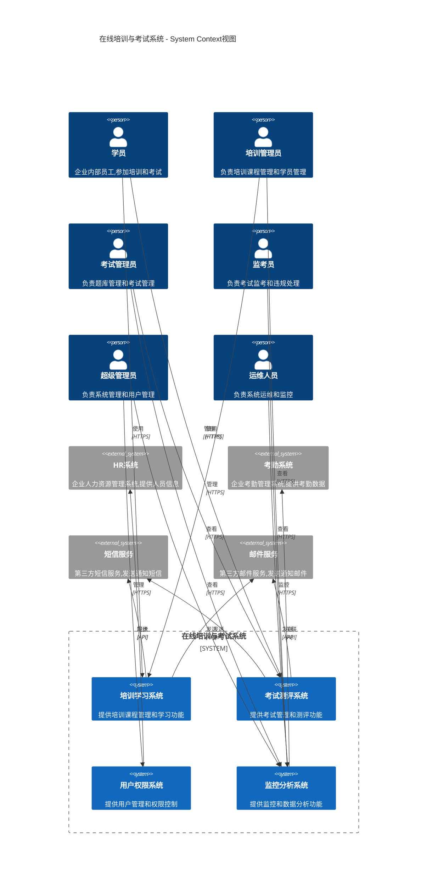
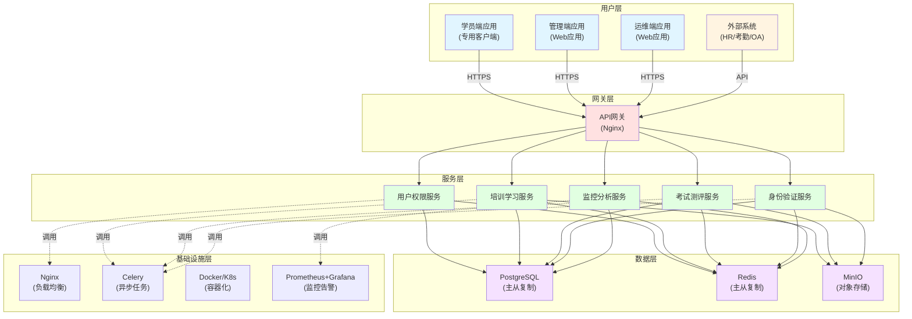
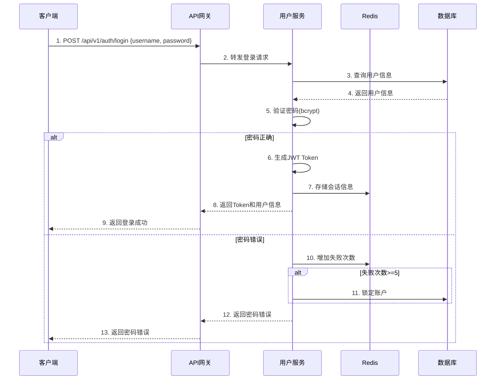

### 3.1 系统Context图

```mermaid
C4Context
    title 在线培训与考试系统 - System Context视图

    Person(学员, "学员", "企业内部员工,参加培训和考试")
    Person(培训管理员, "培训管理员", "负责培训课程管理和学员管理")
    Person(考试管理员, "考试管理员", "负责题库管理和考试管理")
    Person(监考员, "监考员", "负责考试监考和违规处理")
    Person(超级管理员, "超级管理员", "负责系统管理和用户管理")
    Person(运维人员, "运维人员", "负责系统运维和监控")

    System_Boundary(c1, "在线培训与考试系统", "企业内部培训与考试管理系统") {
        System(培训学习系统, "培训学习系统", "提供培训课程管理和学习功能")
        System(考试测评系统, "考试测评系统", "提供考试管理和测评功能")
        System(用户权限系统, "用户权限系统", "提供用户管理和权限控制")
        System(监控分析系统, "监控分析系统", "提供监控和数据分析功能")
    }

    System_Ext(HR系统, "HR系统", "企业人力资源管理系统,提供人员信息")
    System_Ext(考勤系统, "考勤系统", "企业考勤管理系统,提供考勤数据")
    System_Ext(短信服务, "短信服务", "第三方短信服务,发送通知短信")
    System_Ext(邮件服务, "邮件服务", "第三方邮件服务,发送通知邮件")

    Rel(学员, 培训学习系统, "使用", "HTTPS")
    Rel(学员, 考试测评系统, "使用", "HTTPS")
    Rel(培训管理员, 培训学习系统, "管理", "HTTPS")
    Rel(培训管理员, 监控分析系统, "查看", "HTTPS")
    Rel(考试管理员, 考试测评系统, "管理", "HTTPS")
    Rel(考试管理员, 监控分析系统, "查看", "HTTPS")
    Rel(监考员, 监控分析系统, "查看", "HTTPS")
    Rel(超级管理员, 用户权限系统, "管理", "HTTPS")
    Rel(超级管理员, 监控分析系统, "查看", "HTTPS")
    Rel(运维人员, 监控分析系统, "监控", "HTTPS")
    Rel(用户权限系统, HR系统, "同步", "API")
    Rel(监控分析系统, 考勤系统, "关联", "API")
    Rel(培训学习系统, 短信服务, "发送", "API")
    Rel(考试测评系统, 短信服务, "发送", "API")
    Rel(培训学习系统, 邮件服务, "发送", "API")
    Rel(考试测评系统, 邮件服务, "发送", "API")
```

### 3.2 系统架构图

```mermaid
graph TB
    subgraph 用户层["用户层"]
        StudentApp["学员端应用<br/>(专用客户端)"]
        AdminApp["管理端应用<br/>(Web应用)"]
        OpsApp["运维端应用<br/>(Web应用)"]
        ExternalSys["外部系统<br/>(HR/考勤/OA)"]
    end

    subgraph 网关层["网关层"]
        APIGateway["API网关<br/>(Nginx)"]
    end

    subgraph 服务层["服务层"]
        UserService["用户权限服务<br/>"]
        TrainingService["培训学习服务<br/>"]
        ExamService["考试测评服务<br/>"]
        AuthService["身份验证服务<br/>"]
        MonitorService["监控分析服务<br/>"]
    end

    subgraph 数据层["数据层"]
        PostgreSQL["PostgreSQL<br/>(主从复制)"]
        Redis["Redis<br/>(主从复制)"]
        MinIO["MinIO<br/>(对象存储)"]
    end

    subgraph 基础设施层["基础设施层"]
        Nginx["Nginx<br/>(负载均衡)"]
        Celery["Celery<br/>(异步任务)"]
        Docker["Docker/K8s<br/>(容器化)"]
        Prometheus["Prometheus+Grafana<br/>(监控告警)"]
    end

    StudentApp -->|HTTPS| APIGateway
    AdminApp -->|HTTPS| APIGateway
    OpsApp -->|HTTPS| APIGateway
    ExternalSys -->|API| APIGateway

    APIGateway --> UserService
    APIGateway --> TrainingService
    APIGateway --> ExamService
    APIGateway --> AuthService
    APIGateway --> MonitorService

    UserService --> PostgreSQL
    UserService --> Redis
    TrainingService --> PostgreSQL
    TrainingService --> Redis
    TrainingService --> MinIO
    ExamService --> PostgreSQL
    ExamService --> Redis
    ExamService --> MinIO
    AuthService --> PostgreSQL
    AuthService --> Redis
    AuthService --> MinIO
    MonitorService --> PostgreSQL
    MonitorService --> Redis

    UserService -.->|调用| Nginx
    TrainingService -.->|调用| Celery
    ExamService -.->|调用| Celery
    AuthService -.->|调用| Celery
    MonitorService -.->|调用| Prometheus

    style StudentApp fill:#e1f5ff
    style AdminApp fill:#e1f5ff
    style OpsApp fill:#e1f5ff
    style ExternalSys fill:#fff4e1
    style APIGateway fill:#ffe1e1
    style UserService fill:#e1ffe1
    style TrainingService fill:#e1ffe1
    style ExamService fill:#e1ffe1
    style AuthService fill:#e1ffe1
    style MonitorService fill:#e1ffe1
    style PostgreSQL fill:#f5e1ff
    style Redis fill:#f5e1ff
    style MinIO fill:#f5e1ff
```

### 1.1.1 用户名密码认证

```mermaid
sequenceDiagram
    participant C as 客户端
    participant A as API网关
    participant U as 用户服务
    participant R as Redis
    participant D as 数据库

    C->>A: 1. POST /api/v1/auth/login {username, password}
    A->>U: 2. 转发登录请求
    U->>D: 3. 查询用户信息
    D-->>U: 4. 返回用户信息
    U->>U: 5. 验证密码(bcrypt)
    alt 密码正确
        U->>U: 6. 生成JWT Token
        U->>R: 7. 存储会话信息
        U-->>A: 8. 返回Token和用户信息
        A-->>C: 9. 返回登录成功
    else 密码错误
        U->>R: 10. 增加失败次数
        alt 失败次数>=5
            U->>D: 11. 锁定账户
        end
        U-->>A: 12. 返回密码错误
        A-->>C: 13. 返回密码错误
    end
```
