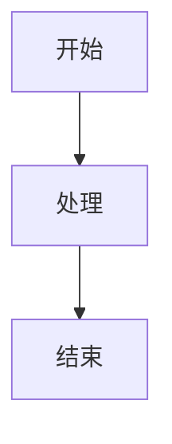

# mdast2docx 本地集成版本

本目录包含了 mdast2docx 及其所有依赖的完整源代码，已集成到项目中以便深度定制。

## 目录结构

```
src/utils/mdast2docx/
├── core/                   # @m2d/core (1.7.1) - 核心库
│   └── src/
│       ├── index.ts        # 主入口，导出 toDocx
│       ├── section.ts      # Section 处理
│       └── utils/          # 工具函数
│
├── emoji/                  # @m2d/emoji (0.1.3) - Emoji 支持
│   └── dist/              # 编译后的 JS（源码已删除）
│       ├── emoji.js
│       ├── index.js
│       └── index.d.ts
│
├── html/                   # @m2d/html (1.1.11) - HTML 转换
│   └── src/
│       ├── index.ts
│       └── utils.ts
│
├── image/                  # @m2d/image (1.4.0) - 图片处理 ⭐
│   └── src/
│       ├── index.ts        # 主入口
│       ├── svg-utils.ts    # SVG 处理工具 ⭐⭐ 关键修改点
│       ├── types.ts
│       └── utils.ts
│
├── list/                   # @m2d/list (0.0.9) - 列表转换
│   └── src/
│       └── index.ts
│
├── math/                   # @m2d/math (0.0.6) - 数学公式
│   └── src/
│       └── index.ts
│
├── mermaid/                # @m2d/mermaid (1.2.2) - Mermaid 图表 ⭐
│   └── src/
│       └── index.ts
│
├── table/                  # @m2d/table (0.1.1) - 表格转换
│   └── src/
│       └── index.ts
│
├── svg-fns/                # @svg-fns 系列包
│   ├── io/                # @svg-fns/io (1.0.0) - SVG 解析
│   │   ├── client.ts      # 客户端版本
│   │   ├── index.ts
│   │   ├── server.ts      # 服务端版本
│   │   └── types.ts
│   │
│   └── svg2img/           # @svg-fns/svg2img (0.0.0) - SVG → PNG ⭐⭐
│       ├── client.ts      # 客户端版本（使用 Image 对象）
│       ├── index.ts
│       ├── server.ts      # 服务端版本（使用 sharp）
│       ├── types.ts
│       └── utils.ts
│
├── mdast2docx/            # mdast2docx (1.6.1) - 主包
│   ├── src/
│   │   ├── index.ts       # 主入口
│   │   ├── section.ts
│   │   ├── plugins/       # 插件系统
│   │   └── utils/
│
├── index.ts               # 统一导出
└── README.md              # 本文件
```

## 版本说明

| 包名 | 版本 | 说明 |
|------|------|------|
| mdast2docx | 1.6.1 | 主包 |
| @m2d/core | 1.7.1 | 核心库 |
| @m2d/emoji | 0.1.3 | 仅编译后的 JS |
| @m2d/html | 1.1.11 | 完整源码 |
| @m2d/image | **1.4.0** | 注意：项目使用 1.4.1，但使用 1.4.0 源码 |
| @m2d/list | 0.0.9 | 完整源码 |
| @m2d/math | 0.0.6 | 完整源码 |
| @m2d/mermaid | 1.2.2 | 完整源码 |
| @m2d/table | 0.1.1 | 完整源码 |
| @svg-fns/io | 1.0.0 | 完整源码 |
| @svg-fns/svg2img | 0.0.0 | 完整源码 |

## 核心问题定位

Mermaid 导出失败的关键代码路径：

```
Markdown → Mermaid 代码
  ↓
@m2d/mermaid → 渲染为 SVG 字符串
  ↓
@m2d/image/src/svg-utils.ts → handleSvg()
  ↓
@svg-fns/svg2img/src/client.ts → svgToBlob()
  ↓
new Image().src = dataUrl  ← ❌ 失败点（大型 SVG）
```

## 关键修改点

### 1. @svg-fns/svg2img/src/client.ts

**问题**: `svgToBlob()` 使用 `new Image().src = dataUrl` 无法加载大型 SVG

**解决方案**:
- 添加 Worker 版本（使用 `OffscreenCanvas` + `createImageBitmap`）
- 添加 Cherry 预览缓存支持
- 添加多种回退方案（canvg, html2canvas）

### 2. @m2d/image/src/svg-utils.ts

**问题**: 直接调用 `svgToBlob()` 导致失败

**解决方案**:
- 优先使用 Cherry 预览缓存的 PNG
- 支持传递自定义的 SVG → PNG 转换函数
- 改进错误处理和日志

## 使用方法

### 基本用法

```typescript
import { toDocx } from '@/utils/mdast2docx';
import { fromMarkdown } from 'mdast-util-from-markdown';

// 1. 解析 Markdown
const mdast = fromMarkdown(markdownContent);

// 2. 转换为 DOCX
const docxBlob = await toDocx(mdast, {
    title: 'Document Title',
    // ... 其他 docx 选项
});

// 3. 下载
const url = URL.createObjectURL(docxBlob);
const a = document.createElement('a');
a.href = url;
a.download = 'document.docx';
a.click();
```

### 使用 Cherry 预览缓存

```typescript
import { toDocx } from '@/utils/mdast2docx';
import { captureRenderedMermaidPngs } from '@/components/CherryEditor';

// 1. 捕获 Cherry 预览中的 Mermaid PNG
const pngCache = await captureRenderedMermaidPngs();

// 2. 传递给 mdast2docx
const docxBlob = await toDocx(mdast, {
    title: 'Document Title',
    renderedPngCache: pngCache,  // ← 传递缓存
});
```

### 自定义 Mermaid 处理

```typescript
import { toDocx } from '@/utils/mdast2docx';
import customMermaidPlugin from '@/utils/mdast2docx/mermaid';

// 使用自定义的 mermaid 插件
const docxBlob = await toDocx(mdast, {
    title: 'Document Title',
    plugins: [
        customMermaidPlugin({
            mermaidOptions: {
                startOnLoad: false,
                theme: 'default',
            },
        }),
    ],
});
```

## 开发说明

### 修改源码后的处理

1. **直接修改**: 直接编辑 `src/utils/mdast2docx` 下的源文件
2. **重新编译**: 如果修改了 TypeScript 文件，Vite 会自动重新编译
3. **测试**: 修改后立即测试导出功能

### 依赖管理

这些源码已经脱离了 npm 包管理，不需要在 `package.json` 中声明依赖。

**但是**，仍需要保留以下外部依赖：

```json
{
  "dependencies": {
    "docx": "^9.5.1",      // DOCX 生成库
    "mermaid": "11.12.2"   // Mermaid 渲染引擎
  }
}
```

### 升级源码

如果需要更新这些包的源码：

1. 从 GitHub 或 npm 获取最新源码
2. 覆盖对应的目录
3. 检查是否有 breaking changes
4. 测试功能是否正常

## 调试技巧

### 启用详细日志

```typescript
// 在 @m2d/image/src/svg-utils.ts 中
console.log('[md2docx] SVG size:', svgString.length);
console.log('[md2docx] Converting SVG to PNG...');
```

### 检查 SVG 尺寸

```typescript
// 在 CherryEditor.vue 中
const svgElements = previewerDom.querySelectorAll('svg');
for (const svg of svgElements) {
    const bbox = svg.getBBox();
    console.log('SVG size:', bbox.width, 'x', bbox.height);
}
```

### 测试特定 Mermaid 图表

```markdown

```

## 已知问题

1. **@m2d/image 版本**: 使用 1.4.0 源码，项目使用 1.4.1，可能存在 bug 修复的差异
2. **@m2d/emoji**: 仅编译后的 JS，无法修改源码
3. **大型 SVG**: 仍需依赖 Cherry 预览缓存或外部工具（canvg）

## 参考文档

- [原始调查报告](../../../../../docs/research/docx-mermaid/2025-01-27-mermaid-word-export-attempts.md)
- [依赖分析报告](../../../../../docs/research/docx-mermaid/mdast2docx-依赖分析报告.md)
- [mdast2docx GitHub](https://github.com/md2docx/mdast2docx)
- [docx.js GitHub](https://github.com/dolanmiu/docx)

---

**维护者**: 项目团队
**最后更新**: 2025-01-27
**状态**: 开发中
